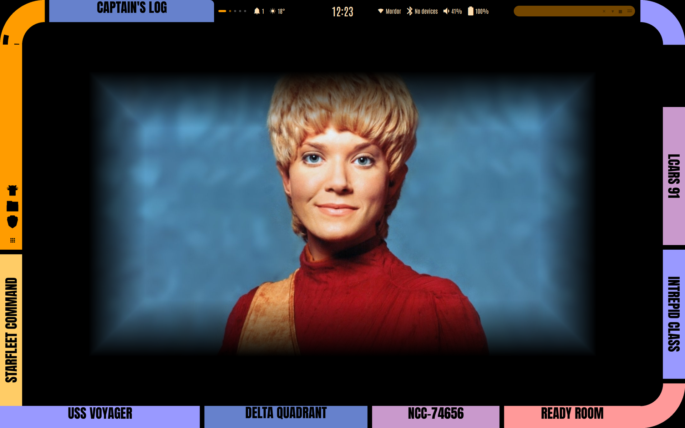
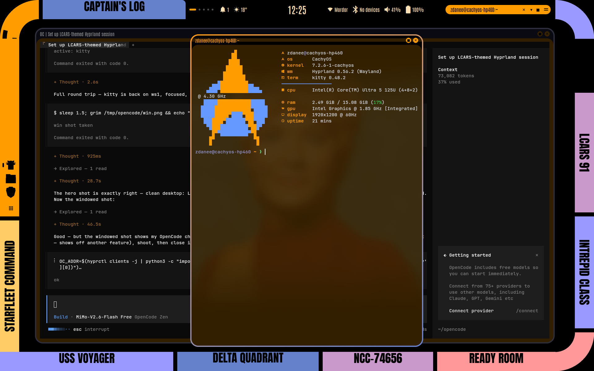

<p align="center">
  
</p>

<h1 align="center">Voyager LCARS — an impasto paint pass</h1>

<p align="center">
  A <b>Star Trek: Voyager</b> LCARS desktop for <b>Hyprland</b>, painted over the
  <a href="https://github.com/andreumassanet/impasto">impasto</a> quickshell shell.<br>
  Tested on CachyOS · Hyprland 0.56 · quickshell 0.3
</p>

<p align="center">
  
</p>

This repo is a **paint pass**: a snapshot of a verified, running LCARS rice laid
wholesale over a stock impasto install. Every file under `files/` lands in
`~/.config/…` as-is, so re-running the apply after `./setup update` restores the
look. 

## What you get

- **LCARS chrome** — 62 px top/left bands with Okuda elbows, CAPTAIN'S LOG and
  STARFLEET COMMAND plates, a status island merged into the band (clock, bell,
  weather, network / volume / battery) and a corner CPU/RAM gauge on the
  astrometrics arch. Active furniture lives **top and left only**; windows are
  free to cover bottom and right.
- **Taskbar on the orange tile** (left edge, bottom-aligned): LCARS tiles with
  black mono icons, launcher as the bottom-most icon, one shared
  right-click menu behind a z-order catcher.
- **Windows** — float-by-default (new windows spawn floating, centred), 4 px
  LCARS borders, gaps_out = 0, **click-to-focus only** (hover never steals
  focus), and **hyprbars titlebars**: black bar, Antonio title in orange,
  orange ✕ ■ chips, dimmed grey when inactive. CSD apps (Firefox, Chrome,
  Discord, VS Code) opt out with `hyprbars:no_bar`.
- **The orange pill** in the top band: ✕ ▾ ■ window controls + drag handle.
  Hide it from its menu and it collapses to an orange circle that opens the
  same menu to bring it back.
- **48 LCARS-framed wallpapers** — one Okuda-style frame, a different Voyager
  scene in the middle of each; rotating, and the only set the picker lists.
  The greeter gets the same art.
- **Terminal greeting** — every fresh kitty window opens with a minimal
  neofetch-style readout: TNG Starfleet delta badge in LCARS orange/blue with
  OS, kernel, WM, terminal, CPU, RAM, GPU, display and uptime. `fa` switches
  to the animated greeting scenes.
- **Dolphin in the LCARS colour scheme**, a fingerprint-enabled lock screen,
  a quick-settings tile (USS VOYAGER) that opens **behind** the windows, and
  an appearance panel where LCARS Voyager is the only theme on offer.
- **Buttons do things**: Captain's log → task board · Delta quadrant →
  browser · Starfleet command → terminal · USS Voyager → quick settings ·
  Astrometrics → statistics · Ready room → notes.

<p align="center">
  
</p>

## Keys

| Keys | Action |
| --- | --- |
| `Alt+Space` | Launcher |
| `Ctrl+Alt+T`, `Super+Return` | Terminal |
| `Super+E` / `Super+B` | File manager / browser |
| `Super+Q` / `Super+F` / `Super+Alt+F` | Close / fullscreen / maximise (keeps the bar) |
| `Super+arrows`, `Alt+Tab` | Focus / cycle windows |
| `Super+Shift+arrows`, `Super+drag` | Move / drag windows |
| `Super+1…9` (+ `Shift`) | Go to / send to workspace |
| `Super+A` / `Super+Tab` / `Super+H` | Control centre / overview / **show every key** |
| `Ctrl+Alt+Del` | Session menu · `Super+L` lock (fingerprint works) |
| 3/4-finger swipe left-right | Switch workspace |
| 3/4-finger swipe up | Workspace overview |
| Calculator key | Calculator |

## Install

```bash
# 0. once — impasto itself (pulls quickshell, the Hyprland config, oh-my-zsh …)
git clone https://github.com/andreumassanet/impasto
cd impasto && ./setup install

# 1. the LCARS paint pass (user level, idempotent)
git clone https://github.com/zdanee/lcars-voyager.git
cd lcars-voyager
./lcars-apply.sh            # LCARS_SKIP_HOME=1 keeps your own .zshrc

# 2. titlebars — the hyprbars plugin, built against the running compositor
hyprpm add https://github.com/hyprwm/hyprland-plugins
hyprpm disable borders-plus-plus 2>/dev/null || true
hyprpm disable csgo-vulkan-fix    2>/dev/null || true
hyprpm disable hyprfocus          2>/dev/null || true
hyprpm enable hyprbars
hyprpm reload

# 3. system bits — session entry, greeter art, system fonts, fingerprint PAM
sudo ./lcars-system.sh

# 4. log out and pick "LCARS · Voyager (Hyprland)" at the session picker
```

Notes:

- After an impasto update (`./setup update`) the stock config is back — just
  run `./lcars-apply.sh` again. It is safe to run twice.
- `LCARS_SKIP_HOME=1` skips `files/home/` (the author's `.zshrc` snapshot).
  What the rice adds there is the **GREETING** section — `fastfetch` on fresh
  shells — and the `fa` scene function; copy those two blocks into your own rc.
- `lcars-system.sh` is written for a machine with the **Plasma greeter**
  (`plasmalogin`, CachyOS): step 1 (the session entry) is portable, the
  greeter steps skip themselves where the pieces are missing.
- **hyprpm caches are root-owned** — run step 2 from a terminal that can sudo,
  or prefix with `sudo` if it complains.
- Everything is guarded: a missing tool (starship, fzf, fnm, fastfetch …)
  prints nothing rather than an error.

## The repo

```
files/quickshell → ~/.config/quickshell   shell: bar, island, dock, lock, settings
files/hypr       → ~/.config/hypr         palette, keybinds, gestures, rules, titlebars
files/kitty      → ~/.config/kitty        terminal (palette/font written at runtime)
files/fastfetch  → ~/.config/fastfetch    the greeting readout + delta badge
files/autostart  → ~/.config/autostart    KDE colour restore hook
files/home       → ~                      .zshrc (skip with LCARS_SKIP_HOME)
wallpapers/      → ~/.local/share/wallpapers   the 48 framed pieces
fonts/           → ~/.local/share/fonts        Anton + Antonio (SIL OFL)
LCARS.colors     → ~/.local/share/color-schemes   Dolphin / KDE scheme
lcars-apply.sh                           the paint pass (user level)
lcars-system.sh                          session, greeter, fonts, PAM (sudo)
lcars_wallpaper.py + sources/            regenerate or restyle the art
```

### Regenerating the wallpapers

The frame never changes; the centre art does:

```bash
./lcars_wallpaper.py wallpapers/lcars-mine.png sources/janeway.jpg
./lcars-apply.sh                      # re-install the set
```

`sources/` holds the scene photos, `voyager-source.jpg` is the default centre.
Output is 3840×2400 (2× the panel) with the LCARS border, elbows and Anton
labels drawn in.

## Credits

- **[impasto](https://github.com/andreumassanet/impasto)** by andreumassanet —
  the shell this is painted over (GPL-3.0). Docs:
  <https://andreumassanet.github.io/impasto-docs/>
- **Hyprland** and **[hyprland-plugins](https://github.com/hyprwm/hyprland-plugins)**
  (hyprbars) — the compositor and the titlebars
- **quickshell**, **fastfetch**, **kitty**, **starship**, **Dolphin**
- **Anton** (Vernon Adams) and **Antonio** (Vernon Adams) — the LCARS
  typefaces, SIL OFL, bundled in `fonts/`
- *Star Trek: Voyager* imagery © Paramount — this is fan art for personal use,
  not affiliated with or endorsed by Paramount/CBS.

## License

GPL-3.0 (see [LICENSE](LICENSE)) — the same license as impasto, which this
config is derived from. Fonts stay under the SIL Open Font License; the
wallpapers are fan art, personal use only.
